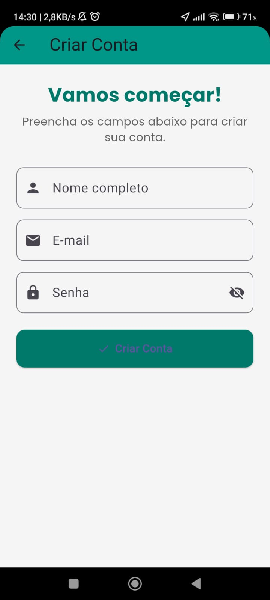
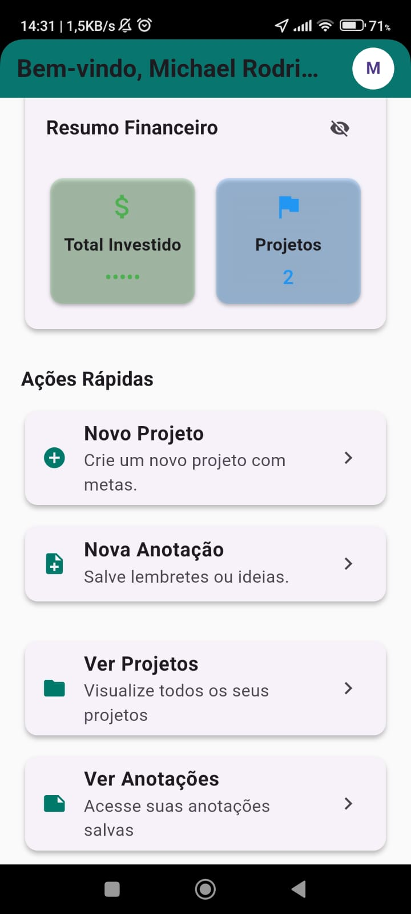
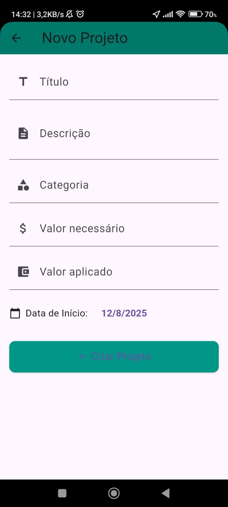
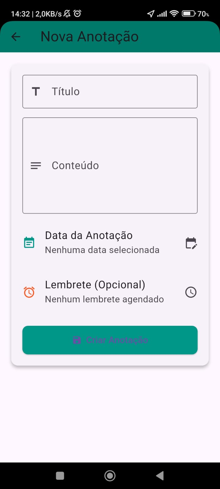
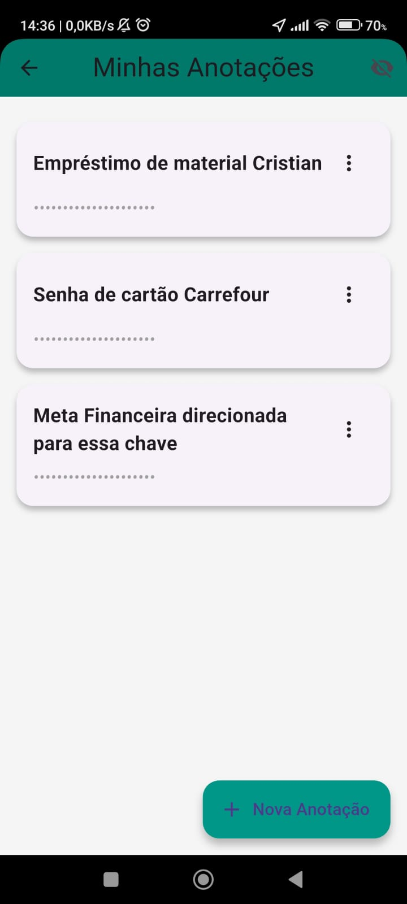

# 📱 meu_app_financas

Aplicativo de gerenciamento financeiro pessoal desenvolvido em **Flutter**, criado para atender às minhas necessidades de forma prática e organizada.  
Com ele, posso:

- 💰 **Controlar minhas finanças**
- 🎯 **Definir metas financeiras**
- 📝 **Fazer anotações e registrar ideias importantes**
- 📅 **Organizar e acompanhar projetos**
- 🔔 **Receber notificações e lembretes** (em desenvolvimento)
- 🔒 **Ativar modo privacidade** para momentos em que o app é aberto em público
- 🔐 **Proteger rotas com autenticação**

---

## 📖 Descrição

O **meu_app_financas** foi pensado para oferecer **controle, praticidade e segurança**.  
Com ele, posso gerenciar minha vida financeira e minhas ideias em um só lugar, criando, editando e excluindo projetos e anotações com facilidade.  
Também há um modo de **privacidade** e autenticação para proteger dados sensíveis.

Além disso, o app conta com:
- **Notificações locais** (implementadas)
- **Armazenamento offline**  salvar login
- **Integração com APIs e backend próprio** pesiste dado no mongoDb
- **Fontes personalizadas**
- **Design otimizado para Android** (iOS em breve)

---

## 🖼️ Screenshots

<p align="center">
  
  
  
  
  
  
  
</p>

---

## 🚀 Tecnologias Utilizadas

- **⚙️ Flutter SDK**
- **💻 Dart SDK** `>=3.8.1 <4.0.0`

### 📦 Pacotes principais:
- `cupertino_icons` – Ícones estilo iOS
- `http` – Cliente HTTP
- `intl` – Formatação de datas, números e moedas
- `google_fonts` – Tipografia personalizada
- `flutter_local_notifications` – Notificações locais
- `timezone` – Suporte a fuso horário
- `shared_preferences` – Armazenamento local
- `connectivity_plus` – Verificação de conexão
- `permission_handler` – Gerenciamento de permissões
- `flutter_slidable` – Ações deslizáveis em listas
- `pull_to_refresh` – Melhor experiência de atualização de conteúdo
- `syncfusion_flutter_datepicker` – Seletores de data avançados
- `flutter_launcher_icons` – Personalização de ícones

---

🏆 Desafios Enfrentados
Durante o desenvolvimento, enfrentei alguns desafios importantes:

🔄 Envio de token para todos os componentes: garantir autenticação persistente e segura em todas as rotas.

🖥 Criação do backend para comunicação com o app, estruturado para lidar com autenticação, CRUD e segurança.

🗄 Banco de dados MongoDB para persistir dados de forma flexível e escalável.


## 🛠 Configuração do Projeto

Clone o repositório e instale as dependências:

```bash
git clone <URL_DO_REPOSITORIO>
cd meu_app_financas
flutter pub get
